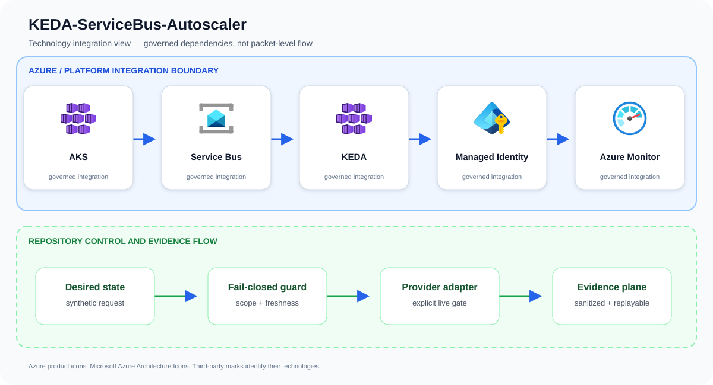
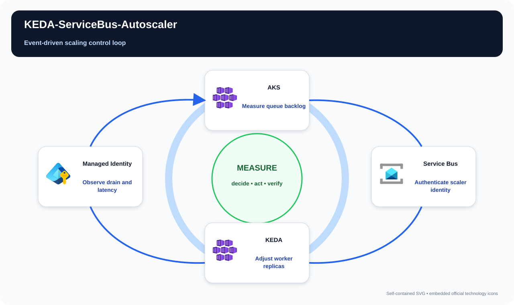

# KEDA-ServiceBus-Autoscaler

Provide cost-efficient, identity-based event scaling from zero for Service Bus workers on AKS.

## Problem statement

A tenant-scoped request describes a Service Bus worker target and secretless identity; the guarded plan validates private access and approval before an adapter applies KEDA scaling configuration.

A production implementation can still fail even when every resource deploys successfully. The material risk is apparently successful automation that lacks bounded scope, a reproducible denial path, or evidence operators can use during review and recovery. The design therefore treats AKS, Service Bus, KEDA, and the surrounding identity and evidence controls as one reviewable system rather than unrelated configuration tasks.

## Example case study

### Situation

An order-processing service is idle overnight but receives sharp campaign-driven queue spikes. This pattern lets workers scale toward zero during quiet periods and respond to backlog without embedding Service Bus connection strings in Kubernetes.

### Response

An order queue spikes after a promotion and is nearly empty overnight. KEDA reads Service Bus metrics through managed identity, scales the worker within bounded limits, and returns safely without storing a broker connection string.

The team first exercises the repository's synthetic approved and denied fixtures. An approved request must produce the same idempotent plan on replay; a stale, unscoped, public, or unapproved request must fail before an Azure adapter is allowed to run.

### Expected outcome

Stakeholders receive a decision package they can attach to a change record: requested scope, controls evaluated, the reason for approval or denial, and the explicit handoff to live integration. The example supports design review and incident rehearsal without pretending that a local test changed Azure.

## Architecture

Producers enqueue representative workloads; KEDA reads queue metrics using workload identity and scales workers. Cluster autoscaler expands a dedicated VMSS-backed pool, while dashboards correlate queue age, replicas, processing rate, failures, and spend.

Primary services: `AKS`, `Service Bus`, `KEDA`, `Managed Identity`, `Azure Monitor`.

This repository implements the first production-oriented vertical slice: a
fail-closed, adapter-neutral control plane that validates tenant scope,
freshness, approvals, secretless identity, private access, and the exact
project action before producing a deterministic execution plan. Azure adapters
consume that plan; they are deliberately outside the local simulator so local
tests cannot claim a live cloud change occurred.



The upper boundary names the principal services and technologies used by this repository. The lower boundary shows the implemented control flow: desired state is validated, provider action remains an explicit integration gate, and sanitized evidence is retained for review and deterministic replay.

## Best complementary diagram

**Recommended view: Event-driven scaling control loop.** A control-loop view is the strongest complement because it shows how observed state becomes a bounded decision, an action, and measured feedback.



The view follows **Measure queue backlog → Authenticate scaler identity → Adjust worker replicas → Observe drain and latency**. Use it during design reviews, operational walkthroughs, and failure-mode discussions; use the logical architecture above when the question is which technologies integrate.

## Quickstart

Requirements: Python 3.11+ and Git. No Azure credentials are required.

```bash
./scripts/validate.sh
python3 src/control_plane.py --request examples/approved-request.json
```

The command emits canonical JSON with a stable idempotency key. The denied
fixture exits with status 2 and explains the failed invariants.

## Security boundaries

- Managed identity or workload identity only; embedded credentials are denied.
- Public network access and stale evidence are denied.
- Production and break-glass targets require explicit approval.
- The IaC entry point is opt-in and defaults to deploying nothing.
- Evidence output contains identifiers and decisions, never credential values.

## Verification and limitations

Local validation covers 13 tests, deterministic replay, JSON parsing, Python
compilation, ignore hygiene, and Bicep compilation when a compiler is present.
It does **not** prove Azure deployment, service licensing, quota, data-plane
permissions, provider/API availability, cloud failover, load, cost, or teardown.
See [`docs/test-matrix.md`](docs/test-matrix.md) and [`docs/runbook.md`](docs/runbook.md) before any integration trial.

## Community

See [`CONTRIBUTING.md`](CONTRIBUTING.md), [`SECURITY.md`](SECURITY.md), [`SUPPORT.md`](SUPPORT.md), and [`LICENSE`](LICENSE). The reference
is intentionally conservative and uses synthetic identifiers only.

## Repository guide

- [Architecture](docs/architecture.md)
- [Threat model](docs/threat-model.md)
- [Operations runbook](docs/runbook.md)
- [Test matrix](docs/test-matrix.md)
- [Cost model](docs/cost-model.md)
- [Security policy](SECURITY.md)
- [Contributing guide](CONTRIBUTING.md)
- [Support policy](SUPPORT.md)
- [Changelog](CHANGELOG.md)
- [License](LICENSE)

## Infrastructure inputs

Resource behavior and deploy-time values are intentionally separated:

- [Bicep template](infra/main.bicep) — Azure resources, modules, and security controls.
- [Bicep parameters](infra/main.bicepparam) — environment-specific names, regions, identities, and feature inputs.

Start with the parameter file's safe values, replace synthetic identifiers, and run an Azure what-if before deployment.

## Attribution

Azure product icons come from [Microsoft's official Azure Architecture Icons](https://learn.microsoft.com/azure/architecture/icons/). Open-source marks are sourced from [Simple Icons](https://simpleicons.org/) when shown; each mark identifies its respective technology.
